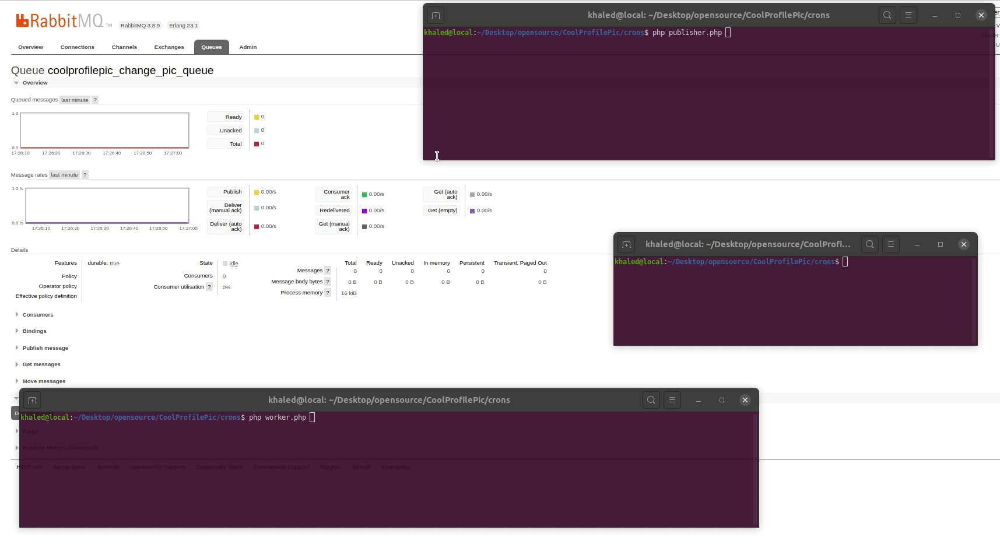
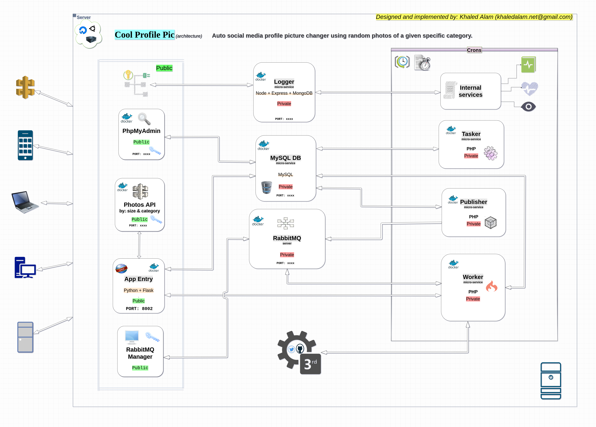
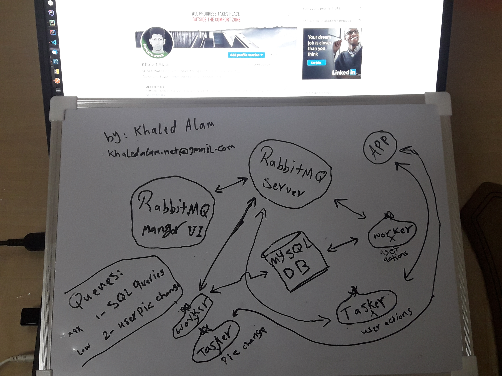
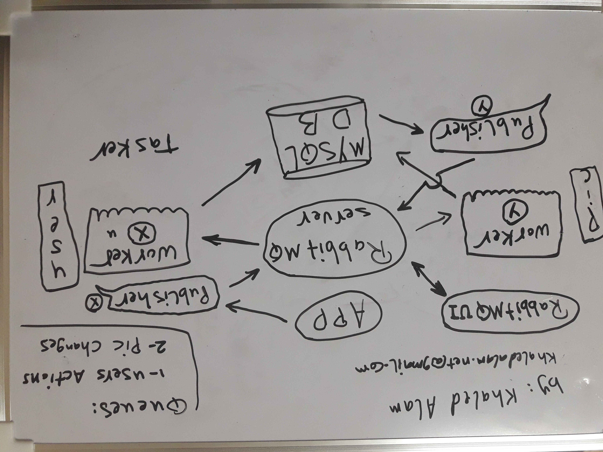

# Cool Profile Pic Doc
CoolProfilePic app helps users to change their social media profile pictures automatically based on settings that they will choose such as new photo category and the changing frequency!

## Using: 
Docker(-compose), DigitalOcean, AWS, Jinja, Linux, Crons, Flask, RabbitMQ, PHP, Python, Node, MySQL, Express, MongoDB, SQL, Social media APIs, Flask_Dance, PDO, TwitterAPI, GitHubAPI, NPM, PhpMyAdmin, Composer, Guzzle, Sockets, PIL

## Demo (the queuing cycle)

### Watch Demo (the whole app) => <a href="https://youtu.be/2foGVjIFKS4">youtube video</a>
 

## Architecture

 
 
### Email me for the source code: <a href="mailto:khaledalam.net@gmail.com">khaledalam.net@gmail.com</a>

 &nbsp; &nbsp; &nbsp;  &nbsp; &nbsp; &nbsp; 

 

## Reflection
The idea of automate changing facebook, twitter github, etc.. profile picture came to my mind few days ago, I decided to build this self project from A to Z using some new strategy and stack as a proof of concept of some things that I want to proof personally by myself.

## Solved Challenges
- Connections between containers issues
- Deadlock issues
- Sockets issues
- Caching common dependencies

Current demo is version 1 of the app

## Version 2 Tweeks:
- use multi workers, publisher, queues, taskers
- mapping DB queries by its types and priority
- improve containerization performance
- design IP blocker microservice
- design mailer microservice 
- handle higher traffic and load
- automate the deployment process and increase its speed
- advertise (image processing -> add watermark @CoolProfilePic text on new images) 

## Random sketches

  

